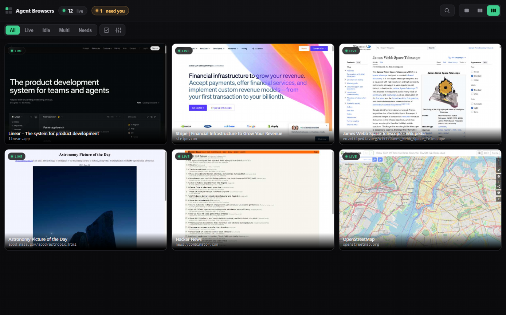
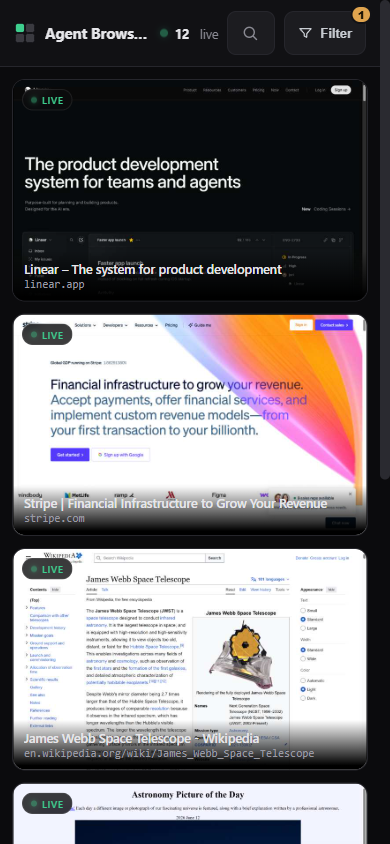

# Agent Browsers

Mission control for AI-driven browsers. When you have a fleet of Playwright / CDP
browsers doing work, this gives you one dashboard to watch them all live from your
phone, tablet, or laptop.

It is a single Node file with **zero dependencies**. It auto-discovers every Chromium
remote-debugging port on the machine, shows each as a live tile, and lets you tap into
any one for a high-resolution focused stream — and, when you need to, take control and
drive it yourself.

> **Watch by default, control when you want it.** Tap **Control** in the focused view to
> click, type, and scroll the real browser from your phone. See [Security](#security) for
> the one boundary (don't drive a fresh sign-in through it).



<p align="center">
  
  <br>
  <em>…and the same dashboard, lived in from your phone.</em>
</p>

## Why

AI agents now drive browsers headfully for hours at a time. A wall of terminal logs does
not tell you when one is stuck on a login wall, has finished, or has quietly broken.
Agent Browsers turns the fleet into a glanceable grid that tells you which ones need you.

## Features

- **Auto-discovery** — every Chromium remote-debugging port on the box becomes a live
  tile. Launch a browser, it appears; close it, it goes away.
- **One multiplexed stream** — all tiles share a single Server-Sent-Events feed, so you
  are not capped by the browser's per-host connection limit no matter how many tiles.
- **Focused high-res view** — tap a tile for a crisp 1080p+ stream: pinch-zoom, tap to
  toggle the chrome away, rotate-to-fill, swipe between sessions, keyboard nav, and an
  overflow menu (pin, rename, copy link, save frame, fullscreen).
- **Take control** — tap **Control** in the focused view to drive the browser yourself:
  tap-to-click, a keyboard for typing (Enter / Backspace / Tab), and drag-to-scroll with
  1:1 finger tracking and inertial flick. Toggle it off to return to watch-only.
- **Organize the grid** — drag to reorder (with a dedicated touch Reorder mode), pin
  favorites to the top, and rename sessions; your arrangement persists.
- **Reliable streaming** — dropped CDP sockets auto-reconnect, a "Reconnecting…" banner
  appears if the server blips (the grid stays up instead of flashing empty), and
  backgrounded browser windows keep animating instead of freezing.
- **Remembers everything** — your sort, columns, cover mode, *and your last view* persist
  per device; reopen the app and you land right where you left off. Shared links still
  override your saved defaults.
- **Awareness** — per-session active / idle / stuck detection, plus a "needs you" badge
  when a browser lands on a login, captcha, or auth wall.
- **Installable PWA, offline-aware** — add to the home screen, screen wake-lock,
  pull-to-refresh, and offscreen tiles pause to save battery. Opens to the app (not a
  blank page) when the server is unreachable, and self-updates to the latest build with
  no reinstall.
- **Settings** — mute "needs you" notifications, and a one-tap "Clear saved data".
- **Shareable URLs** — every session gets a stable, human-readable link (`/wikipedia`),
  plus `/watch/a+b+c` for a chosen subset and `/embed/{slug}` for a wall display.
- **Mobile-first** — designed to be lived in from a phone.

## Requirements

- **Node.js 22+** — it uses the built-in `WebSocket` global to speak CDP (available
  unflagged from Node 21; 22+ recommended). No other runtime. *(The Windows tray app
  auto-downloads a portable Node into your user folder on first run if none is installed —
  no admin, no system change — so end users don't have to install anything.)*
- **No dependencies** — nothing to `npm install`. It is a single `.cjs` file.
- **Runs on Windows, macOS, and Linux.** Zero-config auto-discovery finds Chromium
  remote-debugging ports via PowerShell on Windows and `lsof` on macOS/Linux. On any OS
  you can also skip discovery entirely by listing ports yourself: `PORTS=9222,9223 node
  grid.cjs`.

## Install

> New to this? The [step-by-step install guide](docs/INSTALL.md) walks a first-time user
> through it on Windows or macOS, no coding required.

No package manager and no build step — clone (or just download `grid.cjs`) and run it:

```bash
git clone https://github.com/Zbrooklyn/Agent-Browser-Monitor.git
cd Agent-Browser-Monitor
node grid.cjs
```

Open <http://127.0.0.1:8090>. Launch any Chromium with remote debugging and it shows up:

```bash
# Playwright / Playwright-pool launches already expose a debug port — nothing to do.

# Or launch a plain browser yourself. The --user-data-dir is REQUIRED: without a
# separate profile, the flag is silently ignored if that browser is already running.
chrome --remote-debugging-port=9222 --user-data-dir="$HOME/.chrome-debug"
```

On macOS use the full path
(`"/Applications/Google Chrome.app/Contents/MacOS/Google Chrome" --remote-debugging-port=9222 --user-data-dir=/tmp/chrome-debug`);
on Windows use `"C:\Program Files\Google\Chrome\Application\chrome.exe"` if `chrome` is not
on your PATH. Any Chromium-family browser works (Edge, Brave, Chromium, Vivaldi).

### Watch from your phone (private)

The dashboard binds to `127.0.0.1`. To reach it from your phone without opening a port,
the easy private option is [Tailscale](https://tailscale.com):

```bash
tailscale serve --bg 8090
```

That publishes it on **your tailnet only** (not the public internet) over HTTPS. Open the
printed `https://<machine>.<tailnet>.ts.net/` URL on any device on your tailnet and add it
to the home screen.

On Windows, `start-stream.ps1` / `stop-stream.ps1` wrap this: they launch the dashboard
detached (surviving the shell), set up the tailnet proxy, and print your phone URL.

### Keep it always-on (port guardian)

> **Windows-first.** The always-on tooling below — the guardian, the tray app, auto-start —
> is Windows-only today. The core dashboard (`node grid.cjs`) runs anywhere; on macOS/Linux
> you'd keep it alive with your own `launchd`/`systemd` unit.

If you rely on the dashboard at a fixed port/URL, `port-guardian.ps1` makes the port
**stay yours**. It is a tiny supervisor loop that:

- restarts `grid.cjs` within seconds if it ever crashes or is killed, and
- evicts any other process that has grabbed the port during a gap, then rebinds the
  dashboard (and re-points the `tailscale serve` proxy at it).

There is no OS-level "reserve this port for one app" on Windows — a low port goes to
whoever binds it first, and `netsh` exclusions lock it out for *everyone*. Continuously
occupying the port (and reclaiming it on any gap) is what actually keeps it yours.

```powershell
# run it now (foreground)
powershell -ExecutionPolicy Bypass -File port-guardian.ps1 -Port 8090

# start at logon: drop a one-line .vbs in your Startup folder that launches it hidden
#   shell:startup  ->  AgentBrowsersGuardian.vbs:
#   CreateObject("WScript.Shell").Run "powershell -WindowStyle Hidden -ExecutionPolicy Bypass -NoProfile -File ""<path>\port-guardian.ps1"" -Port 8090", 0, False
```

(If your environment allows Task Scheduler, registering it as an `AtLogon` task with
restart-on-failure is tidier; the Startup-folder route is the no-privileges fallback.)

### Tray icon (Windows)

For a visible, controllable presence instead of a hidden background process, build the
tray app. It puts an icon in the system tray — **green = server up**, grey = down — with a
right-click menu (Open dashboard, Copy phone link, Restart server, **Quit**). It owns the
guardian, so the icon is the source of truth: if it's showing, the server is running, and
**Quit fully stops everything** (no invisible leftover process). It shows up in Task
Manager as `AgentBrowsers.exe`, not a mystery `node.exe`.

```powershell
# build it (uses the .NET Framework C# compiler already on Windows — no SDK/npm)
powershell -ExecutionPolicy Bypass -File build-tray.ps1
# run it
Start-Process .\AgentBrowsers.exe
```

Auto-start at logon: drop a one-line `.vbs` in your Startup folder (`shell:startup`) that
runs the exe — `CreateObject("WScript.Shell").Run "<path>\AgentBrowsers.exe", 0, False`.
Because the guardian is tied to the tray, closing the tray (even via Task Manager) stops
the server too — nothing keeps running without the icon.

**No Node installed?** On first run the tray fetches a portable Node (~30MB) into
`%LOCALAPPDATA%\AgentBrowsers\node` and uses that — no installer, no admin, and your
system is untouched. A system Node, if present, is always preferred.

> Design note: a tray icon needs an interactive logon session, so this starts at *login*,
> not before it. A true before-login service would have to run headless with no icon — the
> opposite of "you can always see it's running" — so that is deliberately not the default.

## Configuration

All optional, via flags or environment variables:

```bash
node grid.cjs [host] [port]
```

| Env | Default | Meaning |
| --- | --- | --- |
| `HOST` / `PORT` | `127.0.0.1` / `8090` | bind address |
| `TOKEN` | _(none)_ | optional shared secret — when set, the dashboard + control require `?token=…` once per device (see Security) |
| `PORTS` | _(auto-detect)_ | skip auto-discovery and watch exactly these debug ports, e.g. `PORTS=9222,9223` |
| `TILE_Q` / `TILE_W` / `TILE_H` | `55` / `800` / `500` | grid tile JPEG quality + max size |
| `HQ_Q` / `HQ_W` / `HQ_H` | `78` / `1280` / `800` | focused-view JPEG quality + max size. Defaults are phone-sized: at high motion a `1920`q`82` focus stream runs ~2.6 MB/s (~21 Mbps) and buffers on a phone link; `1280`q`78` is ~46% leaner at the same fps and stays crisp. Bump these on a LAN desktop that wants pixel-perfect detail. |
| `TILE_MIN_MS` | `80` | per-tile push rate-cap (see [PERF.md](PERF.md) for phone-link presets) |
| `FOCUS_MIN_MS` | `50` | focused-view push rate-cap (~16–20 fps). The focus socket emits up to ~32 fps on a busy page; capping it roughly halves bytes with no perceptible loss for monitoring. Lower toward `25` for buttery motion at higher bandwidth, raise to throttle a constrained link. |
| `VIEWPORT_FIX` | _(off)_ | set to `1` to render each watched browser at a desktop viewport (`VIEW_W`×`VIEW_H`) so a small/narrow window streams the whole page. **Off by default**: it injects a device-metrics override that fights any automation client (Playwright/Puppeteer) managing the page's own viewport — the two thrash and the watched page flickers/zooms. Only enable it for plain, non-automated browsers. |
| `VIEW_W` / `VIEW_H` | `1280` / `800` | desktop viewport used when `VIEWPORT_FIX=1` |
| `KEEPALIVE` | _(off)_ | set to `1` to force focus-emulation + active lifecycle so a **backgrounded** watched tab keeps rendering at full rate (Chrome throttles unfocused tabs). **Off by default**: it mutates the page (`document.hasFocus()`, lifecycle) and can interfere with automation clients. Idle tiles are re-seeded by the recapture sweep regardless, so leave it off unless you watch real backgrounded windows and need them buttery. |
| `STUCK_MS` | `25000` | a top-frame navigation still loading this long with no load event → "stuck" |
| `NO_UPDATE_CHECK` | _(unset)_ | set to disable the once-a-day GitHub update check (see Updates) |

## Updates

Each instance is self-hosted, so to let people running their own copy know when a new version
ships, the server asks GitHub once at startup (and daily) for the latest **published Release** and,
if it's newer than the running `VERSION`, shows a small dismissible "update available" chip in the
dashboard linking to the release. It only **notifies** — it never modifies anyone's code; you update
with `git pull` (or re-download `grid.cjs`) and restart.

- **To notify everyone of an update:** bump `VERSION` in `grid.src.cjs` (+ `package.json`), then
  publish a [GitHub Release](https://github.com/Zbrooklyn/Agent-Browser-Monitor/releases) whose tag
  is the new version (e.g. `v2.3.0`). Every running instance picks it up within a day.
- **Privacy / airgapped:** the check is a single outbound request to `api.github.com`. Set
  `NO_UPDATE_CHECK=1` to turn it off entirely — the dashboard then never contacts the network.

## How it works

- Discovers Chromium debug ports, connects to each page target over the CDP WebSocket,
  and runs `Page.startScreencast` to receive JPEG frames.
- Tiles share one SSE feed (id-tagged frames). The focused view opens a second,
  higher-quality screencast on demand, seeded with `Page.captureScreenshot` so a static
  page is never blank.
- Pure Node: a built-in `WebSocket` client speaks CDP, an `http` server serves the app
  and the streams. No build step, no `node_modules`.

## Building from source

**Running it needs no build** — `grid.cjs` is committed as a single, self-contained,
zero-dependency file; download it and `node grid.cjs`. The build step is only for *editing*.

The shipped `grid.cjs` is **generated** — don't hand-edit it (your changes are overwritten on
the next build). Edit the modular source instead and rebuild:

```bash
# source: grid.src.cjs (the app) + src/*.cjs (state, slug, cdp, security — pure, unit-tested)
node build.cjs      # or: npm run build   → inlines src/*.cjs into a single grid.cjs
npm test            # node --test, zero deps (state machine, slug, CDP reducer, origin guard)
npm run bench       # hot-path perf bench (see PERF.md)
```

The bundler (`build.cjs`) inlines every `require('./src/*.cjs')` so the deployed artifact stays
one zero-dependency file — modular to develop, single-file to ship.

## Security

### Threat model

The server binds to `127.0.0.1` and is meant to be reached only over your own tailnet
(`tailscale serve`). The realistic adversary is **a malicious web page open inside one of
the watched browsers** that tries to script `fetch()` against the dashboard to drive your
fleet, exfiltrate, or close sessions. The mitigations below are built around that.

| Surface | Mitigation |
|---|---|
| `/api/input` (clicks/keys/scroll) & `/api/kill` (close a session) | **Origin-guarded, always on.** A browser attaches the page's real `Origin` to any cross-origin request; only local/tailnet origins (loopback, `*.ts.net`, tailscale CGNAT `100.64/10`, RFC-1918 LAN) are accepted, every public origin is rejected `403`. Verified by `test/security.test.cjs`, incl. CGNAT/RFC-1918 boundary and `*.ts.net` suffix-spoof cases. |
| Watched-page content rendered on the wall (tile title, URL, domain) | **No injection vector.** Every watched-page string is written with `.textContent`, never `innerHTML`; the server emits `/api/sessions` via `JSON.stringify`. HTML-entity decoding uses a detached `<textarea>` (RCDATA — an `` is inert text, no load fires). A hostile `<title>` is shown literally, it cannot run script on the dashboard. |
| Request flooding | `/api/input` and `/api/kill` bodies are hard-capped (16 KB / 4 KB) and the socket is destroyed past the limit. |
| MIME sniffing / URL leakage | Every response carries `X-Content-Type-Options: nosniff` and `Referrer-Policy: no-referrer` (keeps a `?token=` URL out of `Referer`). |

### Access control

- **Optional shared secret.** Set `TOKEN=…` to lock the whole dashboard *and* control behind
  a token — open it once per device with `?token=YOUR_TOKEN` (it sets a long-lived `SameSite=Lax`
  cookie). Recommended if your tailnet has devices/users you don't fully trust. Without it,
  *viewing* is open and only *control* is origin-guarded. A request with **no** `Origin` header
  (a non-browser client like curl) passes the origin guard by design — set `TOKEN` to gate those too.
- Binds to `127.0.0.1`. Nothing is exposed until you choose to. A tailnet via `tailscale serve`
  is the recommended private option. **Never put it on the public internet.**

### Operational notes

- **Don't drive a fresh sign-in through it.** Browsers launched for CDP are flagged as
  automation, so a freshly typed Google/SSO password is refused ("this browser may not be
  secure") — that is the provider's policy, not a bug. Control works fine on sessions that
  are *already* signed in; do the login itself in a normal browser (or via a passkey).

## Troubleshooting

**The grid is empty / "no sessions yet."** Nothing is exposing a CDP debug port, or
discovery did not find it. Check:

1. Is a browser actually running with `--remote-debugging-port`? Visit
   `http://127.0.0.1:9222/json` (swap in your port) — you should get a JSON list of tabs.
   If that page fails, the browser is not listening (most often the `--user-data-dir` was
   missing, so the flag was ignored because the browser was already open).
2. Skip discovery and name the port directly: `PORTS=9222 node grid.cjs`. If tiles appear,
   auto-discovery is the issue; if not, the port is not a live CDP endpoint.
3. The port must be on `127.0.0.1` (loopback). A browser bound to `0.0.0.0` or a remote
   host is not auto-discovered — pass it via `PORTS=`.

**A tile shows "stuck."** That session has not painted a new frame for `STUCK_MS` (90s by
default). A genuinely idle page is normal; lower `STUCK_MS` if you want a tighter signal.

**Can't reach it from my phone.** The server binds to `127.0.0.1` on purpose. Use
`tailscale serve --bg 8090` (above) and open the printed `https://…ts.net/` URL on a device
on the same tailnet.

## Roadmap

- **Multi-tab drill-in** — see and switch between a session's tabs, not just its active one.
- **Real video streaming (WebRTC)** — smoother, higher-frame-rate than the JPEG screencast.
- **Recording / clips** — capture a session to a short clip you can save.
- **Agent coordination** — pause the driving agent while you take control, then hand back.

Single-machine by design: it watches the box it runs on. Run one instance per machine.

## License

MIT
